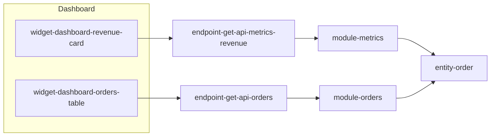

Inventory the UI surface of this {{STACK_NAME}} application — every widget, button, form, table, and action a user can interact with — and trace each one all the way to data.

Arguments: $ARGUMENTS

Tasks:
1. Read:
   - `CLAUDE.md`
   - `docs/architecture/progress.md`
   - `docs/architecture/entry-points.md`
   - `docs/architecture/module-map.md` (if present)
   - `docs/architecture/data-models.md` (if present)
2. If this stack has no frontend (check CLAUDE.md stack summary and the `{{UI_SURFACE_HINTS}}` block below), write a minimal `docs/architecture/ui-surface-map.md` stating "No UI surface detected — this stack is headless" with evidence, then stop.
3. Otherwise, inventory the UI surface using the hints below. For each UI element, capture:
   - **page / route** it lives on
   - **element type** (button, form, table, list, card, modal, drawer, nav item, etc.)
   - **action triggered** (emit, submit, navigate, mutation)
   - **handler** (file + function)
   - **endpoint(s) called** — cross-link to `entry-points.md#endpoint-...`
   - **service / module involved** — cross-link to `module-map.md#module-...`
   - **entities read / written** — cross-link to `data-models.md#entity-...`
   - **side effects** (navigation, toast, modal open, socket emit, analytics)

## Stack-specific UI hints

{{UI_SURFACE_HINTS}}

## Output

Write `docs/architecture/ui-surface-map.md` with these sections:

### Page catalog

Table of all pages/routes. Each row: route path, page component, primary purpose, key widgets on it (link to their widget anchors).

### Widget catalog

One subsection per widget, using the anchor `### Widget name {#widget-{page}-{name}}`. Include:
- element type and what it displays
- what the user can do with it
- full trace: widget → handler → endpoint → service → entity
- evidence (file paths and line numbers for each hop)
- confidence label

### UI → data summary table

A single flat table: widget slug | triggers | endpoint | service | entity. This is the "quick answer" view of the map and becomes a primary input to `/architecture-flowchart`.

### Mermaid overview

One `flowchart LR` grouping pages → widgets → endpoints (sampled — include the 10–15 highest-traffic or highest-value widgets, not all of them). Every node uses the slug ID and a `click` directive per the Cross-linking conventions in `CLAUDE.md`.

Example diagram shape:

### Backlinks

List which steel threads, workflows, and entry-points files reference these widgets.

## Rules

- Evidence-first: cite the file + function for every widget, handler, and endpoint mapping. No invented clicks.
- Group by page, not by element type. A user's mental model is page-first.
- If a widget is decorative or navigation-only (no API call, no mutation), note it briefly but don't bulk out the catalog with it.
- If the UI is a separate repository (common with SPAs + backend APIs), say so and scope this doc to the parts you can see.
- Confidence labels on every entry: **confirmed** if you traced the full handler, **likely** if the binding is conventional but unverified, **speculative** if inferred from naming only.
